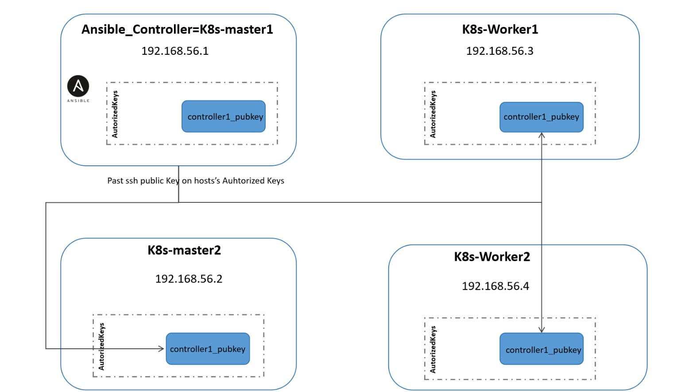

# Kubernetes Cluster Setup with Vagrant and Ansible

## Architecture

The architecture involves setting up a Kubernetes cluster using Vagrant and Ansible. The setup includes one or more controller nodes and worker nodes. Ansible is installed only on the first controller node (`controller1`). The SSH public key generated on `controller1` is distributed to all other nodes to facilitate secure communication.



### Key Points
- **Controller Nodes**: Manage the cluster and schedule the workloads.
- **Worker Nodes**: Run the applications in the cluster.
- **SSH Key Distribution**: A single SSH key pair is generated on `controller1`, and the public key is copied to all other nodes to allow passwordless SSH access.

## Prerequisites

- Vagrant
- VirtualBox
- Ansible

## Commands to Provision VMs and Deploy Kubernetes Cluster

### Step 1: Initialize Vagrant and Create VMs

Open a terminal and navigate to the directory where your Vagrantfile is located. Run the following command to initialize and provision the VMs:

```sh
vagrant up 
```
### Step 2: SSH into Controller1
When VMs are provisioned, now SSH into the controller1 to deploy the Kubernetes cluster:
```sh
vagrant ssh controller1
```

### Step 3: Deploy Kubernetes Cluster with Ansible
Once logged into controller1, deploy the Kubernetes cluster using Ansible:
```sh
ansible-playbook -i /Kubernetes-cluster-provisioning/inventory -f Kubernetes-cluster-provisioning/setup.yaml

```


